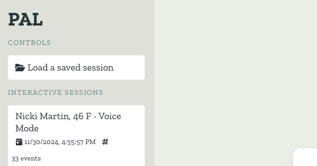
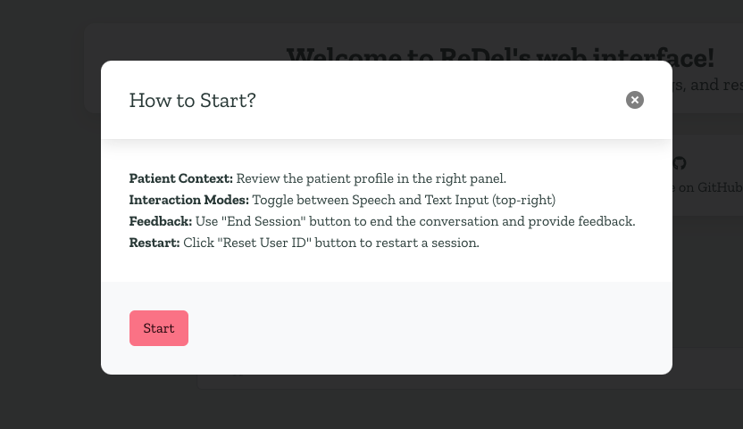

# Progress Report

Below, you can find small UX improvements to the palliative care chatbot within the ReDel web application.

## Changes Made

### Updated Landing Page Navigation
- Disabled the ability to start a new session, ensuring clinicians are directed toward existing patient sessions.

---

### Added Instructions for Interactive Sessions
- Introduced a popup to provide instructions when a user clicks on an interactive session.
- **UX Decision:** To avoid frustrating users with repetitive popups, used `sessionStorage` to ensure the popup appears only once per browser tab session or when the user resets their user ID.

---

### Matched Emoji to Patient Profiles
- Standardized emoji usage across patient profiles and text conversations, ensuring consistency.
- Addressed cross-state emoji jumps (e.g., `AssistantStream.vue`, `AssistantThinking.vue`, and `AssistantMessage.vue`) by passing the emoji across all states.

---

### Fixed a Small Bug in `Interactive.vue`
- Resolved an issue where the fallback image path for patient profiles was incorrect.

